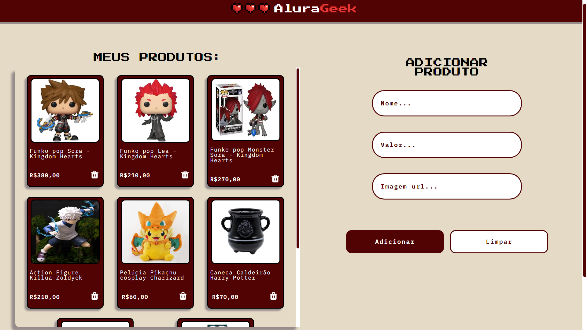
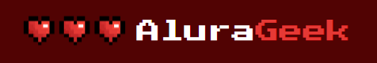

# <h1 align="center"> [AluraGeek](https://alura-geek-ochre-ten.vercel.app/) </h1>


<p align="center">
  
</p>

## Índice

* [1. Introdução](#1-introdução)
* [2. Requisitos](#2-requisitos)
* [3. Ferramentas e mecanismos usados](#3-ferramentas-e-mecanismos-usados)
* [4. Instruções para rodar o projeto](#4-instruções-para-rodar-o-projeto)
* [5. AluraGeek aqui](#5-alurageek-aqui)
* [6. Projeto desenvolvido por](#6-projeto-desenvolvido-por)


## 1. Introdução

Este projeto foi desenvolvido como parte do curso da Alura, como o segundo desafio da formação Front-end. O objetivo do AluraGeek é construir uma site que faça requisições a uma API e implemente um sistema CRUD focado principalmente nas operações de criação, leitura e exclusão para gerenciar o catálogo de produtos de um e-commerce fictício.

Embora o projeto tenha um modelo de design inicial fornecido, os participantes têm liberdade para realizar alterações, visando aprimorar suas habilidades e aplicar os conhecimentos adquiridos durante o curso.

#challengeAluraGeek

## 2. Requisitos
[✔] Simular uma API com json-server

[✔] Implementar requisição GET para obter dados

[✔] Renderizar os produtos dinamicamente na interface

[✔] Implementar requisições POST para criar e excluir produtos

[✔] Ser responsivo

## 3. Ferramentas e mecanismos usados
— HTML

— CSS

— JavaScript

— VSCODE

— Figma

— Git

# 4. Instruções para rodar o projeto

Nosso projeto tinha como desafio implementar um CRUD, para o qual criamos um arquivo db.json para simular uma API. Para executar o projeto localmente, você precisará utilizar o JSON Server como servidor. Abaixo, segue o passo a passo detalhado para você rodar o projeto e testar todas as funcionalidades do CRUD.

#### Passo a Passo para Clonar e Rodar o Projeto com JSON Server
  1. Abra o terminal.

  2. Execute o comando: ```git clone https://github.com/CatarinaEudoxia/aluraGeek.git```

  3. Navegue até o diretório do projeto ```clonado: cd aluraGeek```

  4. Instale as dependências do projeto (Tenha o Node.js instalado no seu sistema.): ```npm install``` 

  5. Inicie o JSON Server com o arquivo "db.json": ```json-server --watch db.json```

Com o JSON Server rodando, você pode agora testar as funcionalidades do projeto que dependem da API simulada.

#### Certifique-se de ter a extensão Live Server instalada no Visual Studio Code e de iniciá-la para visualizar o projeto localmente.

# 5. AluraGeek aqui:

### Aproveite e de uma olhadinha no projeto [AluraGeek!](https://alura-geek-ochre-ten.vercel.app/)

<p align="center">
  
</p>

<br>

# 6. Projeto desenvolvido por:

  <table>
    <tr>
      <td align="center">
        <a href="#">
          <br>
          <sub>
            <b>Catarina Eudoxia Ferreira</b>
          </sub>
        </a>
      </td>
    </tr>
  </table>
